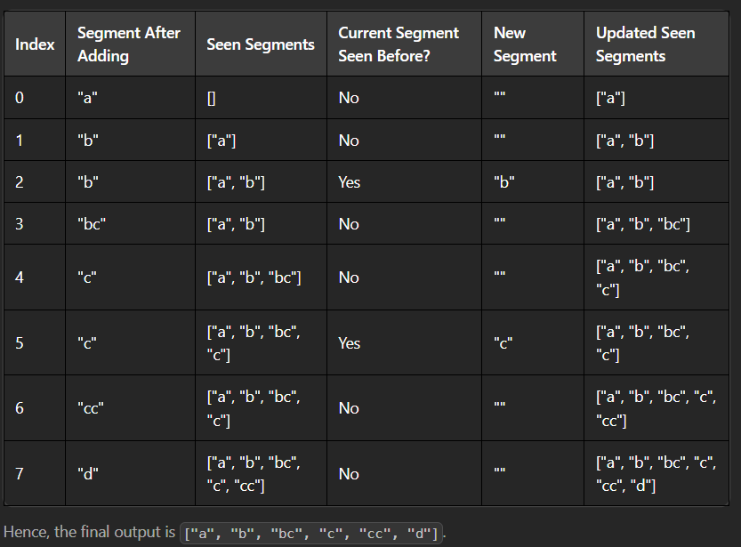
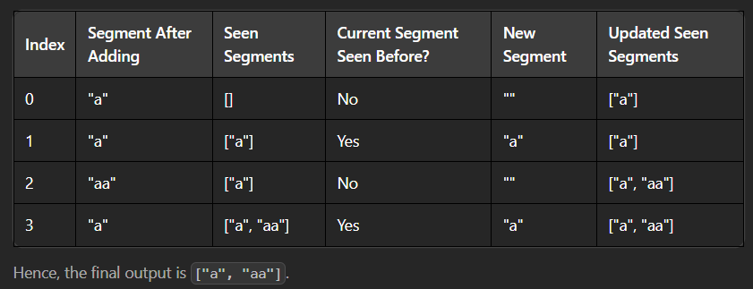

# Partition String (LeetCode #3597)

🔗 [Problem Link](https://leetcode.com/problems/partition-string/)

## 🧠 Problem Statement

Given a string s, partition it into unique segments according to the following procedure:

Start building a segment beginning at index 0.
Continue extending the current segment character by character until the current segment has not been seen before.
Once the segment is unique, add it to your list of segments, mark it as seen, and begin a new segment from the next index.
Repeat until you reach the end of s.
Return an array of strings segments, where segments[i] is the ith segment created.

### Example

Example 1:

Input: s = "abbccccd"

Output: ["a","b","bc","c","cc","d"]

Explanation:

Example 2:

Input: s = "aaaa"

Output: ["a","aa"]

Explanation:

### Constraints:

1 <= s.length <= 10^5

s contains only lowercase English letters.